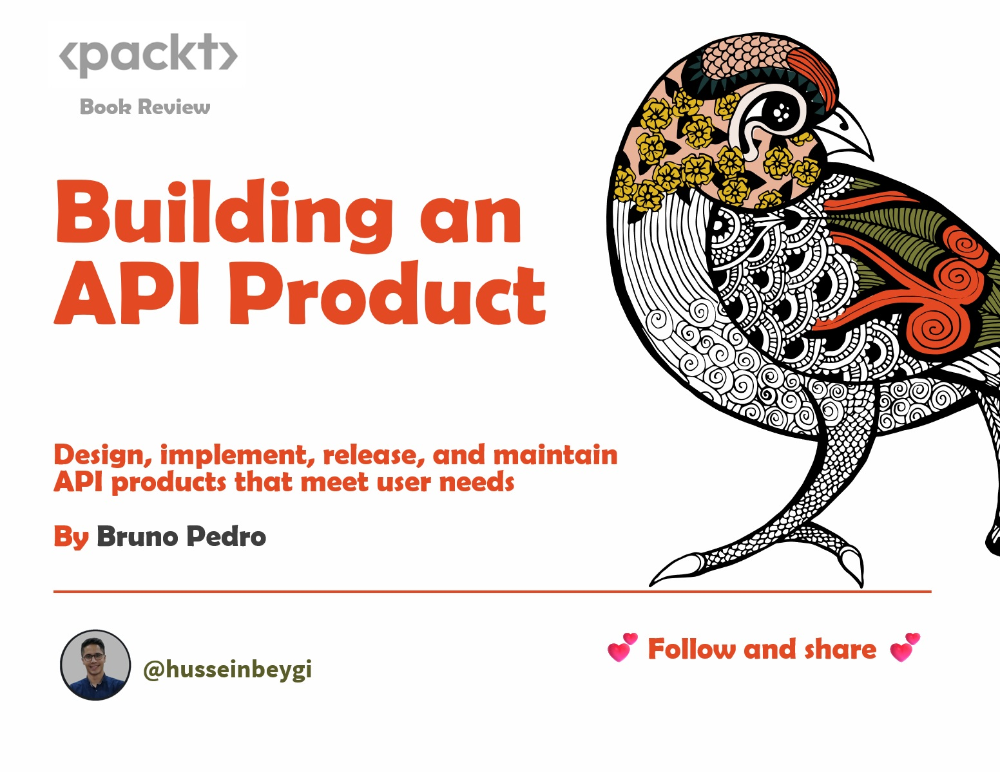

This review analyzes "Building an API Product" by focusing on its key concepts and how it guides readers through the API development process.

**Structure and Flow:**

The book follows a well-structured approach, guiding readers from the fundamentals of APIs to their design, implementation, and deployment. Each chapter builds upon the previous one, ensuring a comprehensive understanding.

**Key Strengths:**

* **Gradual Learning Curve:** The book starts with basic API concepts and progressively introduces more advanced topics like security and testing.
* **Focus on User Needs:** It emphasizes understanding user personas and their needs to design successful APIs.
* **Actionable Steps:** The chapters provide practical guidance with techniques and tools for designing, validating, and securing APIs.
* **Real-World Examples:** The book uses real-world examples to illustrate concepts, making them easier to grasp.
* **Emphasis on API Lifecycle:** It covers the entire API lifecycle, from design to deployment and versioning.

**Content Highlights:**

* **API Fundamentals:** Explores the history and evolution of APIs, different types (local vs. remote), and relevant technologies.
* **API User Experience:** Discusses various user personas interacting with APIs and the importance of minimizing friction.
* **API as a Product:** Explains how to monetize APIs, provide user support, and ensure security.
* **API Design:** Covers the design process, including ideation, strategy, definition, validation, and specification.
* **API Security:** Emphasizes secure design principles, authentication, authorization, and testing methodologies.
* **API Testing:** Explains contract, performance, and acceptance testing to ensure API functionality and consistency.
* **API Deployment:** Discusses continuous integration (CI) for automated deployments, versioning strategies, and API gateways.

**Overall Impression:**

"Building an API Product" is a valuable resource for anyone involved in creating and managing APIs. Its clear explanations, practical guidance, and focus on user needs make it an excellent choice for developers, product managers, and anyone seeking to understand the API landscape.

**In conclusion, "Building an API Product" offers a well-structured and informative guide to the world of APIs. Its emphasis on practical application and user-centric design makes it a valuable asset for anyone involved in API development.**
